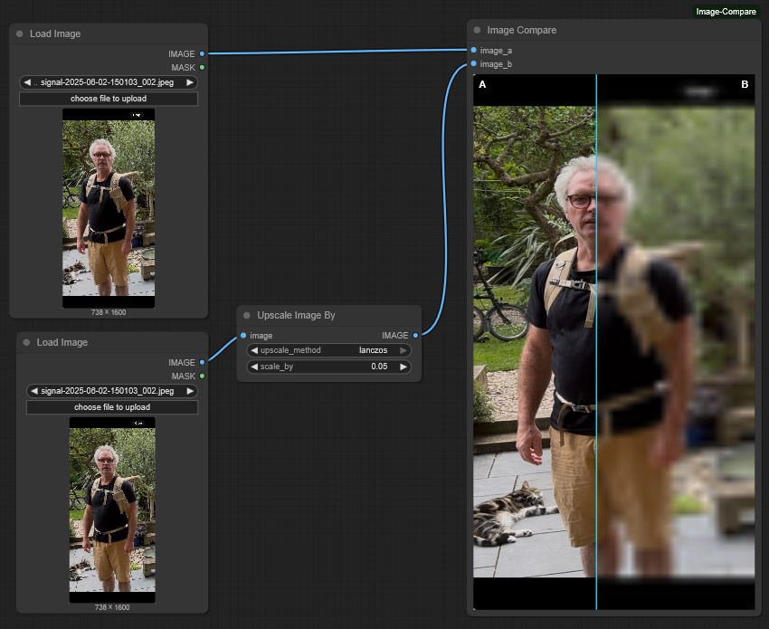

# ComfyUI Image Compare

Compare two images using ComfyUI.

## Install ComfyUI Image Compare

<!-- Install the custom node **ComfyUI Image Compare** using the manager, or you can use your command/terminal prompt. -->

1. Navigate to your `ComfyUI/custom_nodes` folder.
2. Run,

```bash
git clone https://github.com/Sean-Bradley/ComfyUI-Image-Compare.git
```

3. Restart ComfyUI

You will find the new **Image Compare** node in the **Nodes** menu item under **SBCODE**.

Or you can double click the workspace and search for `image compare`

## Example Usage


